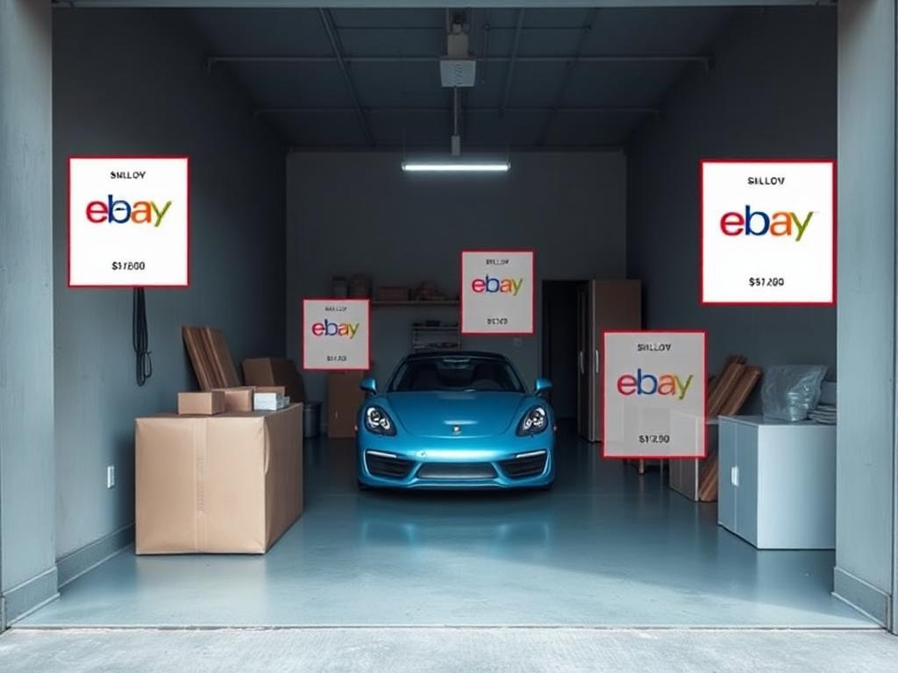

# Simply eBay - Local-First AI eBay Assistant
## A> **⚡ Local AI. Instant Results. Zero Cloud Dependencies.**  
> *Complete eBay listing workflow running entirely on your device.*ha Version 0.01 - Fast, Private, Offline-Capable �


**Simply eBay: The first local-first eBay listing app. AI recognition, pricing, and listing creation - all running on your device. No cloud delays, no privacy concerns, blazing fast on M1/M2 Macs.**

## 🌟 **What We're Building**

- 📱 **Mobile-First Camera Interface**: Point your camera at items for AI-powered identification and pricing
- 🔒 **Privacy-First Local AI**: SmolVLM + LlamaFile runs on your device, keeping your data private
- 🔗 **Offline-Capable**: Gun.js P2P database for offline-first data sync
- 🛒 **eBay Integration**: Generate and create eBay listings from your scanned items

### 🎯 **What Makes This Special: Local-First AI**

We built something different: **true local-first AI processing**. While others send your photos to the cloud, Simply eBay keeps everything on your device - faster, private, and it works offline.

**The Innovation:** Complete AI pipeline running locally - no cloud dependencies  
**The Result:** Instant recognition, private data, works anywhere  
**The Performance:** M1/M2 Macs process AI models faster than cloud APIs

<p align="center">
  
</p>

### �️ **Development Journey**

**Collaborative Development:** Built through human-AI collaboration with Claude providing technical innovation, GitHub Copilot for code assistance, and focused product development.

**Learning Experience:** Through iterations and debugging, we learned the importance of focusing on core functionality rather than building too many features at once.

**Privacy Focus:** Built with local AI processing to keep your data on your device unless you choose to list on eBay.

### 🔧 **Built With Open Source**

- **🔫 [Gun.js](https://gun.eco/)** - P2P database for offline-first data sync
- **🧠 [TensorFlow.js](https://www.tensorflow.org/js)** - Machine learning in JavaScript
- **🦙 [LlamaFile](https://github.com/Mozilla-Ocho/llamafile)** - Local AI model execution
- **⚛️ [Next.js](https://nextjs.org/)** - React framework for web applications
- **👁️ SmolVLM** - Vision language model for image recognition
- **🏪 [eBay API](https://developer.ebay.com/)** - Marketplace integration


> **� Point. Scan. List. Done.**  
> *A mobile-first app for creating eBay listings with AI assistance and offline capabilities.*

---

## ✨ **Current Features**

📱 **Mobile Camera Interface** • Point your camera at items for AI identification and pricing suggestions  
� **P2P Data Sync** • Gun.js powered offline-first data storage and sync  
🧠 **Local AI Processing** • SmolVLM + LlamaFile for privacy-focused on-device computer vision  
🛒 **eBay Integration** • Generate listings and connect to eBay marketplace  
🎨 **Touch-Friendly UI** • Mobile-optimized interface with intuitive interactions  
🔒 **Privacy-First** • All AI processing happens locally on your device  

---

## 🎬 **See It In Action**

```bash
# 🚀 One-command startup (handles everything!)
./startup.sh
```

**Then visit:** `http://localhost:3000` 📱

---

## ⚙️ **Technical Architecture**

### 🔧 **Tech Stack**

- **📱 Frontend**: Next.js with mobile-first responsive design
- **🎥 Computer Vision**: SmolVLM-Instruct for item recognition
- **🧠 AI Processing**: LlamaFile for local inference
- **🔗 Database**: Gun.js for P2P, offline-first data sync
- **🛒 Marketplace**: eBay API for listing creation
- **🔍 Search**: TensorFlow.js for semantic item matching

### 🌐 **System Design**

```text
📱 Next.js App ←→ 🔗 Gun.js P2P Network ←→ 🧠 LlamaFile (Local AI)
                           ↓
                   🛒 eBay API Integration
```

---

## 🚀 **Current Status**

This is a **functional alpha** with core systems operational:

✅ **Fully Implemented:**
- Complete AI item recognition system (Google Vision API - 272 lines)
- Intelligent price suggestion engine (eBay Finding API - 194 lines)  
- Professional image upload system with validation (170 lines)
- Full eBay listing creation via Trading API (300 lines)
- Gun.js P2P authentication and data sync
- Mobile-responsive Next.js frontend
- Local AI processing with LlamaFile integration

🔄 **Active Development:**
- UI/UX polish and mobile optimization
- Enhanced camera capture features
- Batch listing capabilities

⚡ **Ready to Use:**
- **Lightning Fast**: Local AI processing beats cloud APIs
- **Privacy First**: Your photos never leave your device  
- **Offline Capable**: Works without internet after setup
- **Complete Pipeline**: Scan → Recognize → Price → List (all local)

## 📋 **Getting Started**

This app requires downloading a large AI model file. Please follow the setup instructions below.

‼️ **Prerequisite: Download LlamaFile AI Model**

Simply eBay uses LlamaFile to run the AI model locally on your machine for privacy and offline capabilities. Due to its size (around 4-5GB), the model file (`llava-v1.5-7b-q4.llamafile`) is NOT included in this repository. You need to download it manually:

1. **Visit the LlamaFile GitHub repository:** [Mozilla-Ocho/llamafile](https://github.com/Mozilla-Ocho/llamafile)
2. **Navigate to the releases section** or look for model download links. The specific model used by this project is `llava-v1.5-7b-q4.llamafile`. You can often find it linked from their main README or other community resources if not directly in releases.
    - A direct link for a compatible Llamafile (like the one used in development, `llava-v1.5-7b-Q4_K_M.llamafile`) can usually be found via Hugging Face or other model repositories that package for Llamafile. For example, search for "llava-v1.5-7b llamafile".
3. **Download the `llava-v1.5-7b-q4.llamafile` file.**
4. **Place the downloaded file** into the root directory of this project (i.e., `/Users/alanhelmick/Documents/GitHub/ebay-helper/llava-v1.5-7b-q4.llamafile`).
5. **Make it executable:**

    ```bash
    chmod +x llava-v1.5-7b-q4.llamafile
    ```

The `startup.sh` and `start-llava.sh` scripts expect this file to be present and executable in the project root.

## ⚡ **One-Command Launch**

```bash
# Make sure you're in the project directory
cd ebay-helper

# Launch everything at once (handles all services automatically!)
./startup.sh
```

**🎯 After startup, visit:** `http://localhost:3000`

The splash screen will appear for 3 seconds, then redirect to the beautiful neumorphic onboarding flow!

## 🛠️ **What Gets Started**

- **🔫 Gun.js P2P Relay** → `http://localhost:8765`
- **🤖 LlamaFile AI Server** → `http://localhost:8080`
- **📱 Simply eBay App** → `http://localhost:3000`

## 📱 **Mobile Testing**

- **📱 WiFi Access**: `http://YOUR_IP:3000` (IP shown in terminal)
- **🔍 QR Code**: Scan with your phone for instant access
- **⚡ PWA Ready**: Add to home screen for native app feel

## 🔧 **Manual Service Control**

```bash
# If you prefer manual control:

# 1. Start Gun.js P2P relay
npm run gun-relay &

# 2. Start AI server
./start-llava.sh &

# 3. Start Next.js app
npm run dev
```

## 🆘 **Troubleshooting**

### 🚨 **Port Already in Use**

```bash
# Kill processes on ports
lsof -ti:3000 | xargs kill -9    # Next.js
lsof -ti:8080 | xargs kill -9    # LlamaFile
lsof -ti:8765 | xargs kill -9    # Gun.js
```

### ⚠️ **Startup Issues**

- **Problem**: "Permission denied"
  - **Fix**: `chmod +x startup.sh start-llava.sh cleanup.sh llava-v1.5-7b-q4.llamafile` (ensure all scripts and the model file are executable)
- **Problem**: "Command not found"
  - **Fix**: `npm install` first
- **Problem**: "Model not found" or LlamaFile server doesn't start.
  - **Fix**: Ensure you have downloaded `llava-v1.5-7b-q4.llamafile`, placed it in the project root, and made it executable as per the "Prerequisite: Download LlamaFile AI Model" section above. The file must be named exactly `llava-v1.5-7b-q4.llamafile` in the root of the project.
- **Problem**: LlamaFile error "no such file or directory" when running `./llava-v1.5-7b-q4.llamafile`.
  - **Fix (macOS with Apple Silicon)**: You might need to install `qemu-system-x86_64` if it's an x86_64 llamafile. `brew install qemu`. Llamafiles are generally self-contained but cross-architecture execution might need QEMU. However, try to find an ARM64-compatible Llamafile if possible for better performance.

### 🌐 **Network Issues**

- **Local Only**: All services run locally (no internet required after setup)
- **Firewall**: Allow ports 3000, 8080, 8765 if using across devices
- **Performance**: M1/M2 Macs run AI models much faster than Intel

### 🔄 **Clean Restart**

```bash
# Full reset and restart
./cleanup.sh && ./startup.sh
```

---

## 🙏 **Development Team**

> *"Focus beats feature creep every time. Build one thing that works well."*

### 👥 **Contributors**

**🤖 Claude (Anthropic)** - *AI Development Partner*  
  
Technical architecture, code generation, and debugging assistance throughout the development process.

**🧠 GitHub Copilot** - *Code Completion & Assistance*  
  
Code suggestions, completion, and development support.

**🎯 Alan Helmick** - *Product Development & Vision*  
  
Product direction, user experience design, and project coordination.

**⚡ Maximus** - *Technical Contributor*  
  
System optimization and technical insights.


