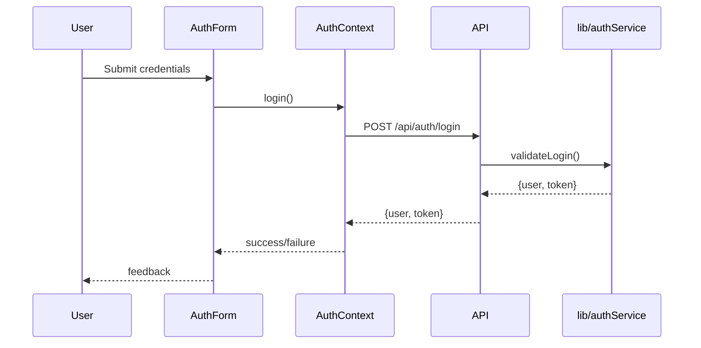

# Phase 3 Architecture Plan

## 1. Overview

This document defines module boundaries, service/component interfaces, and extensibility points for all modules in `components/`, `pages/`, `context/`, and `styles/`. The design enforces modularity, testability, PWA/mobile compliance, and avoids hardcoded secrets.

---

## 2. System Context Diagram

```mermaid
flowchart TD
  subgraph UI
    A1[pages/\n(Public & Authenticated)]
    A2[components/\n(UI Widgets)]
    A3[styles/\n(Global & Modular CSS)]
  end
  subgraph State
    B1[context/AuthContext.js]
  end
  subgraph API
    C1[pages/api/\nREST Endpoints]
    C2[lib/\n(Integration Services)]
  end

  A1 -- uses --> A2
  A1 -- imports --> B1
  A2 -- uses --> B1
  A1 -- styled by --> A3
  A2 -- styled by --> A3
  A1 -- fetches --> C1
  C1 -- calls --> C2
  C2 -- external --> E1[(eBay API)]
  C2 -- external --> E2[(Supabase/GUN)]
```

**Legend:**  
- Rectangles: Modules/folders  
- Ovals: External services  
- Arrows: Data/control flow

---

## 3. Module Boundaries & Responsibilities

### components/
- **auth/**: AuthForm, AuthGuard – UI and logic for authentication, context integration.
- **camera/**: LiveCamera, MobileCameraInterface, ReticleOverlay – Camera access, overlays, mobile adaptation.
- **items/**: ImageUploader – Item image upload, validation, feedback.
- **layout/**: Header, Layout, StatusIndicators – App shell, navigation, status.

### pages/
- **Top-level**: _app.js, about.js, dashboard.js, index.js, login.js, onboarding.js, privacy.js, splash.js, terms.js – Route entry points, layout composition.
- **items/**: [itemId].js, index.js, new.js, scan.js – Item CRUD, scanning, detail.
- **api/**: REST endpoints for auth, items, test utilities. No business logic; delegate to lib/.

### context/
- **AuthContext.js**: Provides authentication state and actions to UI.

### styles/
- **globals.css, globals-new.css**: Global and modular CSS, mobile/PWA breakpoints, accessibility.

---

## 4. Service/Component Interfaces

### AuthContext (context/AuthContext.js)
- **Exports:**  
  - `AuthProvider` (React context provider)  
  - `useAuth()` (hook: { user, login(), logout(), register(), isLoading })
- **Responsibilities:**  
  - Manage auth state, persist via secure storage, expose to UI.

### AuthForm (components/auth/AuthForm.js)
- **Props:**  
  - `onSuccess(user)`, `onError(error)`
- **Context:**  
  - Consumes `useAuth()`
- **Extensibility:**  
  - Validation utilities injected, error boundary wrapper.

### API Endpoints (pages/api/)
- **Pattern:**  
  - Accept HTTP requests, validate input, delegate to lib/, return JSON.
- **No secrets or business logic in route handlers.**

### Camera Components (components/camera/)
- **Interfaces:**  
  - Props for device selection, capture callbacks, overlay config.
- **Extensibility:**  
  - Pluggable overlays, mobile/desktop adaptation.

### Item ImageUploader (components/items/ImageUploader.js)
- **Props:**  
  - `onUploadSuccess(url)`, `onError(error)`
- **Extensibility:**  
  - Accepts validation and transformation hooks.

### Layout Components (components/layout/)
- **Header/Layout/StatusIndicators:**  
  - Stateless, receive props/context, no side effects.

### Styles
- **globals.css, globals-new.css:**  
  - Use CSS variables, media queries for mobile, no hardcoded values.

---

## 5. Extensibility Points

- **Validation utilities**: Shared, injected into forms/components.
- **Context providers**: Replaceable for testing/mocking.
- **API/lib boundaries**: All business logic in lib/, API is thin.
- **Theming**: CSS variables, modular class names.
- **Mobile/PWA**: All UI responsive, offline feedback, touch optimizations.

---

## 6. Data Flow (Example: Auth)



---

## 7. Security & Compliance

- No secrets in client code or API routes.
- All sensitive logic in server-side lib/.
- Input validation at API and UI boundaries.
- PWA: manifest, offline.html, service worker, mobile viewport.

---

## 8. File Size & Testability

- Each file < 500 lines.
- All modules export testable units.
- TDD anchors: Each correction/enhancement is testable via exported hooks, utilities, or context.

---

## 9. Glossary

- **Context Provider**: React context for state sharing.
- **API Route**: Next.js API endpoint.
- **Lib/**: Server-side business logic.
- **PWA**: Progressive Web App.